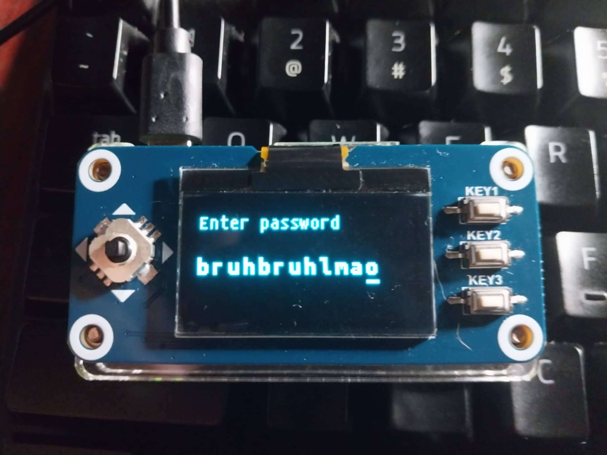
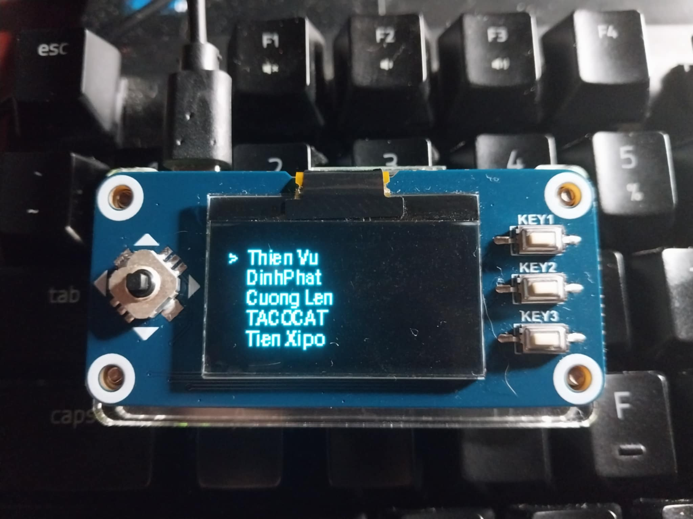
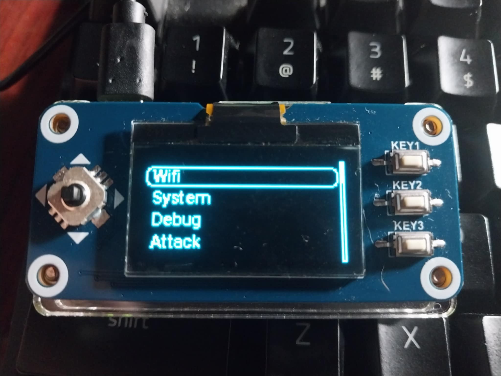

# SH1106_display_module
A display module for Waveshare 1.3inch oled display using SH1106 driver, written in python.

### Features
-   Can input a string, like keyboard
-   Carousel menu, easy to use
-   SPI support
### Module function
-   Connect to wifi and get device's IP (for ssh connection from computer)
-   Shutdown and reboot (thats all :)), adding more functions for attacking later)

### Install
Before installing, remember to install necessary packages for module, listed in ``requirements.txt``.

Install fonts:
```bash
sudo apt install fonts-ubuntu
sudo apt install fonts-roboto
sudo apt install fonts-hack
```


Create a custom systemd service:
```bash
sudo vim /etc/systemd/system/Oled-display.service
```

Enter service config:
```ini
[Unit]
Description=UI for oled display
After=network.target

[Service]
ExecStart=/usr/bin/python3 <git folder path>/main.py
Restart=always
User=root
WorkingDirectory=<git folder path>
StandardOutput=append:/var/log/Oled-display.log
StandardError=append:/var/log/Oled-display_error.log

[Install]
WantedBy=multi-user.target
```

Reload system daemon, enalbe service and start service:
```bash
sudo systemctl daemon-reload
sudo systemctl enable Oled-display.service
sudo systemctl start my_service.service
```

### Uninstalling
Just stop the service, disable then remove the service file, then reload daemon:
```bash
sudo systemctl stop my_service.service
sudo systemctl disable Oled-display.service
sudo rm /etc/systemd/system/Oled-display.service
sudo systemctl daemon-reload
```

### Image 
Some images from module:
-   Enter a string

-   Listing AP

-   Carousel's main menu 


### Next target
-   Do the range adjust UI (like volumn adjust)
-   Make some fancy UI (pokedex similar, if have time)
-   Make transition animation (this one cost lots of RAM, so its depend)
-   Make a guide how to use interface for coding.
-   Develop more features (for network attack)
