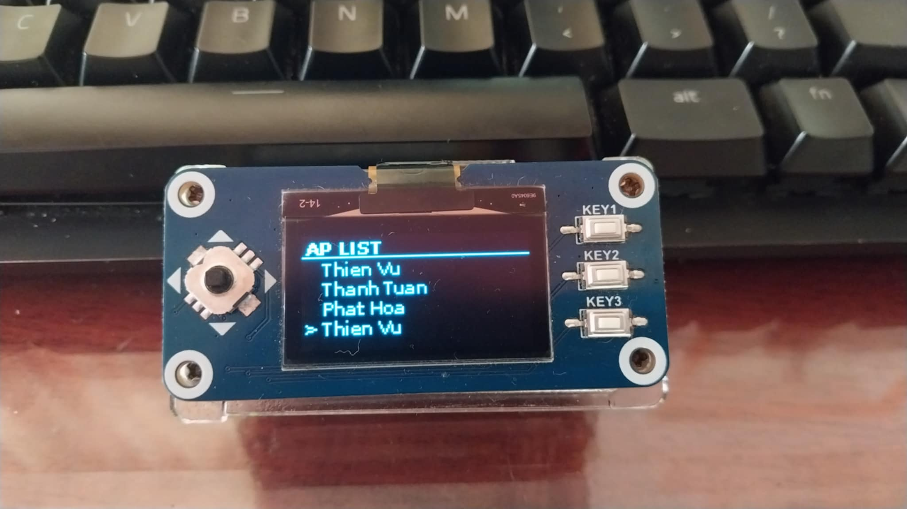

# OLED display module Pi Zero
A general display module for Waveshare 1.3inch oled display using SH1106 driver, written in python.
You can found production info in [here](https://www.waveshare.com/1.3inch-oled-hat.htm)

## Overview
-   [1 .Features](#1-features)
-   [2. Module function](#2-module-function)
-   [3. Install](#3-install)
-   [4. Uninstall](#4-uninstall)
-   [5. Image](#5-image)
-   [6. Framework usage](#6-framework-usage)
    -   [`CarouselMenu`](#carouselmenu)
    -   [`ListOption`](#listoption)
    -   [`Keyboard`](#keyboard)
-   [7. Future development plan](#7-future-development-plan)

### 1. Features
-   Can input a string, like keyboard
-   Carousel menu, easy to use
-   SPI support (Currently only SPI, and probaly won't develop the I2C since all PiZero support both method)
### 2. Module function

-   Connect to wifi and get device's IP (for ssh connection from computer, typically I prefer ssh OTG)
-   Shutdown and reboot (thats all :)), adding more functions for attacking later)
-   Get surrounded Wifi's information.
-   The project does not support scaling display (fixed 128x64 screen)

### 3. Install
Before installing, remember to install necessary packages for module, listed in ``requirements.txt``.

Install fonts:
```bash
sudo apt install fonts-ubuntu
sudo apt install fonts-roboto
sudo apt install fonts-hack
```


Create a custom systemd service:
```bash
sudo vim /etc/systemd/system/Oled-display.service
```

Enter service config:
```ini
[Unit]
Description=UI for oled display
After=network.target

[Service]
ExecStart=/usr/bin/python3 <git folder path>/main.py &
Restart=always
User=root
WorkingDirectory=<git folder path>
StandardOutput=append:/var/log/Oled-display.log
StandardError=append:/var/log/Oled-display_error.log

[Install]
WantedBy=multi-user.target
```

Reload system daemon, enalbe service and start service:
```bash
sudo systemctl daemon-reload
sudo systemctl enable Oled-display.service
sudo systemctl start my_service.service
```

### 4. Uninstall
Just stop the service, disable then remove the service file, then reload daemon:
```bash
sudo systemctl stop my_service.service
sudo systemctl disable Oled-display.service
sudo rm /etc/systemd/system/Oled-display.service
sudo systemctl daemon-reload
```

### 5. Image 
Some images from module:
-   Enter a string

-   Listing AP

-   Carousel's main menu 


### 6. Framework usage
The purpose of project is not only creating a nice interface to interact with Pi Zero device, but also providing a general framework for users to create new features yourself. Let say you have a program A for evil twin attack, and you want to add it to OLED interface for running, or you want to divide section in your way. Most of OLED (p4wnp1 project for example) from my perspective, does not support an easy method for user to program with. Now you can simply call a wrapper and everything should be done without inspecting the internal source code.
#### `CarouselMenu`
You probably gonna use this alot.

To create a CarouselMenu:
```python
from interface import CarouselMenu
menu = CarouselMenu(itemlist = { "Action A" : funcA, "Action B" : funcB ...}, isBase)
menu.Interactive()
``` 
-   `isBase` only set to True when this is the main base and there is no fallback session when you press back button. If you don't need to do anything with base, just set it to False

``Interactive`` in CarouselMenu does not return value.

#### `ListOption`
Use this when you have a bunch of option, and you want to select one. ListOption get a list and return a value from list.
```python
from interface import ListOption
ls = ListOption()
ls.LoadItems(items = ["Option A", "Option B", "Option C"], prompts = "Your options ?")
chosen_option = ls.Interactive()
```

#### `Keyboard`
Get input from user, and return value.

```python
from interface import keyboard # keyboard = KeyBoard(), this help when I implement new keyboard
keyboard.Interactive(prompt = "Enter your string")
val = keyboard.GetVal()
```

**In all three of the interfaces, they all have some method like : `Up()`, `Down()`, ... Those are function for registering callback to handle button event. I suggest you should not touch it unless you know what you are doing**


#### `Projector`
The purpose of this is to display some message correspond to command status. But it is still under development and not really good for using, also it is kinda buggy. Currently I don't recommend to use it.

### 7. Future development plan
-   [ ] Do the range adjust UI (like volumn adjust)
-   [ ] Make some fancy UI (pokedex similar, if have time)
-   [ ] Make transition animation (this one cost lots of RAM, hard to do, so its depend)
-   [x] Make a guide how to use interface for coding.
-   [ ] Develop more features (for network attack)
-   [ ] New keyboard interface with much better look for using